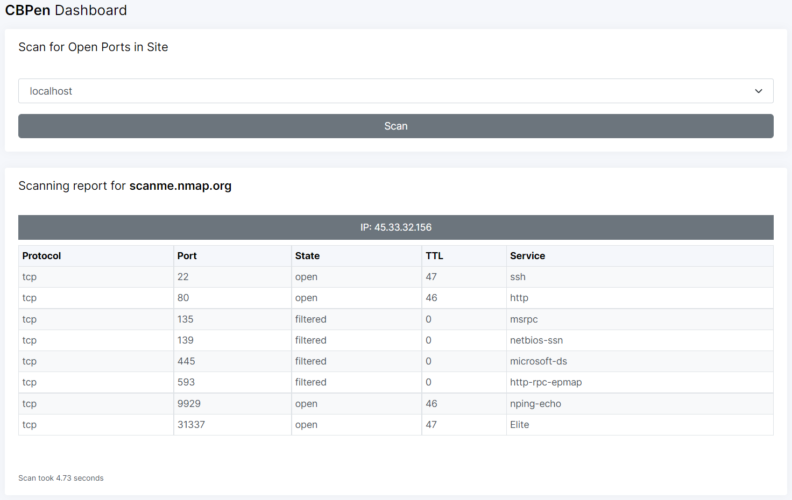

# CBPen
Cloud Blazers Penetration Testing Tool 



## Requirements
- Docker
- Docker compose

## Run the project
- Run the project using the following command:
```commandline
docker-compose build --no-cache
docker-compose up --force-recreate
```
- Access the web application from: [http://localhost:5000/](http://localhost:5000/)
- Down the project:
```commandline
docker-compose down
```

## Clean docker
- Check the running images:
```commandline
docker ps -a
```
- Remove any stopped containers and all unused images:
```commandline
docker system prune -a
```

### Reference
- [Docker compose tutorial](https://docs.docker.com/compose/gettingstarted/)
- [How To Remove Docker Images, Containers, and Volumes](https://www.digitalocean.com/community/tutorials/how-to-remove-docker-images-containers-and-volumes)
- [Icons class in template](https://demo-basic.adminkit.io/icons-feather.html)